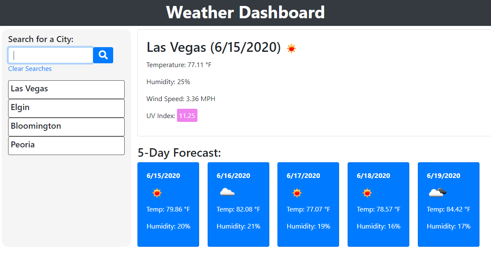

# weather_dashboard

## Links:
Link to repo: <https://github.com/locutusOO1/weather_dashboard>

Link to page: <https://locutusoo1.github.io/weather_dashboard/>

## Summary:
A weather dashboard created using dynamic HTML and API calls to Open Weather Map <https://openweathermap.org/api>. The dashboard shows current weather details for the city as well as a 5-day forecast. Search history is saved to local storage. Opening the site will show the weather for the most recently searched city.

## Technology Used:
* Bootstrap for responsive layout
* jQuery for dynamic HTML & CSS
* localStorage with JSON to retain search history after a browser refresh
* Font Awesome to display icons
* $.getJSON API calls to the Open Weather Map API to get weather details about a searched city

## Screenshot:

